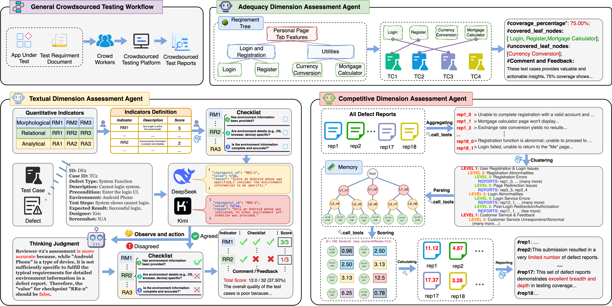

# Multi-dimensional Assessment of CrowdSourced Testing Reports via LLMs

## Overview

This repository contains the implementation of **Multi-dimensional Assessment of CrowdSourced Testing Reports via LLMs**, a comprehensive framework for automatically assessing the quality of crowdsourced testing reports using Large Language Models. The system employs three specialized AI agents to assess crowdsourced testing reports across three critical dimensions: **Textual Dimension**, **Adequacy Dimension**, and **Competitive Dimension**, which respectively focus on the basic text quality of test cases and defects, the coverage of functional points by test cases, and the rarity and novelty of defect discoveries.

This implementation addresses the critical challenge of efficiently reviewing large volumes of crowdsourced testing reports with varying quality submitted by diverse crowd workers. By leveraging the LLM-as-a-Judge paradigm, our framework provides objective, scalable, and consistent assessment while maintaining high accuracy comparable to human expert assessments. The multi-dimensional approach ensures comprehensive assessment from individual report quality, functional requirement coverage, and competitive defect discovery value perspectives.

### Framework Architecture Diagram


*Figure: Overview of the multi-dimensional assessment framework consisting of three specialized LLM-based agents for crowdsourced testing report assessment.*


## Framework Architecture and Code Structure

### Three-Dimensional Assessment Dimension

The framework assesses test reports across three dimensions:

1. **Textual Quality Assessment**: Assesses report quality using morphological, relational, and analytical metrics.
1. **Adequacy Assessment**: Assesses requirement coverage using hierarchical requirement tree analysis.
3. **Competitive Assessment**: Assesses tester performance through defect clustering and uniqueness analysis.

```
code/
├── main.py                 # Main orchestrator for all three agents
├── adequacy_agent.py       # Adequacy assessment implementation
├── textual_agent.py        # Textual quality assessment implementation
├── competitive_agent.py    # Competitive assessment implementation
├── config.py              # Configuration file for API keys and parameters
└── prompts.py             # Centralized prompt management
```

### Key Components

- **main.py**: Main entry point that orchestrates the execution of all three agents.
- **Agent Classes**: Including textual_agent.py, adequacy_agent.py, competitive_agent.py. Each agent implements specialized assessment logic.
- **Configuration Management**: Centralized configuration for LLM APIs and assessment parameters.
- **Prompt Engineering**: Structured prompt templates for consistent LLM interactions.

## Agent Implementations

### 1. Textual Quality Assessment Agent (`textual_agent.py`)

**Purpose**: Assesses the quality of test case and defect report writing using a comprehensive multi-LLM assessment framework.

**Core Architecture**:
- **Dual-LLM Assessment**: Uses DeepSeek and Kimi models for parallel assessment to ensure reliability
- **GPT-4o Arbitration**: Resolves disagreements between the two primary LLMs when conflicts arise
- **Simplified Checkpoint Format**: Optimizes LLM performance through streamlined assessment prompts
- **Configurable Assessment Modes**: Supports both single-LLM and dual-LLM assessment modes

**Key Features**:
- **Three-Dimensional Quality Metrics**: Comprehensive assessment across morphological, relational, and analytical dimensions
- **Intelligent Sampling**: Optional sampling mechanism for large-scale report assessment
- **Quantitative Scoring**: Converts qualitative assessments into numerical scores based on checkpoint pass rates
- **Batch Processing**: Efficiently processes multiple reports with concurrent assessment
- **Detailed Result Tracking**: Maintains complete assessment history with disagreement analysis

**Quality Dimensions & Indicators**:

| Dimension | Indicator ID | Indicator Name | Score | Description | Applicable to |
|-----------|--------------|----------------|-------|-------------|---------------|
| **Morphological** | RM1 | Text Length | 3 | Validates appropriate text length within preset ranges | Both |
| | RM2 | Readability | 2 | Ensures concise, fluent, and understandable descriptions | Both |
| | RM3 | Punctuation | 3 | Checks correct punctuation usage and formatting | Both |
| **Relational** | RR1 | Itemization | 5 | Verifies operational steps are clearly listed with numbered annotations | Both |
| | RR2 | Environment | 3 | Ensures environmental information is present and detailed | Both |
| | RR3 | Preconditions | 2 | Confirms preconditions are described and complete | Both |
| | RR4 | Expected Results | 2 | Validates expected results are filled in standardly | Both |
| | RR5 | Additional Information | 2 | Checks all required fields are completed | Both |
| | RR6 | Screenshot | 3 | Verifies screenshots are provided for defect explanation | Defects only |
| **Analytical** | RA1 | User Interface | 5 | Assesses clarity of interface element descriptions | Both |
| | RA2 | User Behavior | 5 | Assesses description of user interactions and system responses | Both |
| | RA3 | Defect Feedback | 3 | Ensures comprehensive defect feedback is included | Defects only |


**Assessment Process**:
1. **Report Preprocessing**: Formats report data into LLM-friendly structured text
2. **Checklist Generation**: Creates simplified checkpoint IDs mapped to quality indicators
3. **Dual-LLM Assessment**: Parallel assessment by DeepSeek and Kimi models
4. **Disagreement Detection**: Identifies conflicts between LLM assessments
5. **Arbitration Resolution**: Uses GPT-4o to resolve disagreements when enabled
6. **Score Calculation**: Converts checkpoint results to quantitative scores
7. **Result Synthesis**: Combines assessments into comprehensive assessment reports

**Outputs**:
- **Individual Scores**: Per-indicator and per-checkpoint assessment results
- **Overall Score Percentage**: Normalized score representing overall quality (0-100%)
- **Disagreement Statistics**: Count and details of LLM assessment conflicts
- **Processing Metrics**: Assessment time and LLM response characteristics

### 2. Adequacy Assessment Agent (`adequacy_agent.py`)

**Purpose**: Assesses how well test cases cover the specified functional requirements through intelligent requirement tree construction and semantic test case mapping.

**Core Architecture**:
- **GPT-4o Base LLM**: Uses GPT-4o-2024-05-13 with optimized parameters (temperature=0.1, top_p=0.9) for consistent requirement analysis
- **Three-Phase Assessment**: Systematic workflow from requirement parsing to coverage calculation
- **Hierarchical Tree Construction**: Builds structured requirement trees with atomic-level leaf nodes
- **Semantic Mapping Engine**: Maps test cases to requirement nodes using natural language understanding

**Key Features**:
- **Intelligent Requirement Parsing**: Handles both structured and unstructured requirement documents
- **Two-Stage Tree Building**: Initial structure analysis followed by granularity refinement
- **Atomic Functionality Identification**: Decomposes complex requirements into independently testable units
- **Robust Parent-Child Relationship Handling**: Maintains hierarchical integrity with automatic relationship validation
- **Semantic Test Case Mapping**: Uses LLM-powered analysis to match test cases with requirement leaf nodes
- **Comprehensive Coverage Metrics**: Calculates detailed coverage statistics with gap analysis

**Assessment Process**:

#### **Phase 1: Requirement Analysis & Tree Construction**

**Step 1.1 - Initial Structure Analysis**
- Analyzes requirement document to identify hierarchical structures
- Detects numbered sections, functional modules, and semantic groupings
- Generates preliminary requirement nodes with temporary IDs
- Establishes initial parent-child relationships based on document structure

**Step 1.2 - Granularity Refinement & Decomposition**
- Processes each preliminary node for appropriate decomposition
- Splits complex requirements containing multiple independent functions
- Ensures atomic-level granularity (single, clear, independently verifiable)
- Validates leaf node criteria and testability

**Step 1.3 - Tree Construction & Validation**
- Builds final requirement tree with unique node IDs
- Establishes hierarchical paths (e.g., "Authentication/Login/Credential_Validation")
- Validates parent-child relationships and corrects inconsistencies
- Confirms leaf node status based on children presence

#### **Phase 2: Test Case to Requirement Mapping**

**Semantic Matching Process**:
- Extracts test case content (ID, name, description, steps)
- Compares test case semantics against all leaf node descriptions
- Uses GPT-4o to determine coverage relationships through natural language analysis
- Returns mapped leaf node paths for each test case

**Mapping Validation**:
- Handles edge cases where test cases cover multiple requirements
- Manages cases where test cases don't map to any requirements
- Provides reasoning for mapping decisions

#### **Phase 3: Coverage Assessment & Reporting**

**Coverage Calculation**:
- Counts total atomic requirements (leaf nodes)
- Identifies covered vs. uncovered leaf nodes
- Calculates coverage percentage with detailed gap analysis
- Generates comprehensive coverage reports

**Outputs**::
- **Total Atomic Requirements**: Number of leaf nodes identified
- **Covered Requirements**: Number of leaf nodes with test case coverage
- **Coverage Percentage**: (Covered / Total) × 100
- **Coverage Gaps**: Detailed list of uncovered atomic requirements
- **Test Case Distribution**: Mapping details showing which test cases cover which requirements

**Requirement Tree Structure**:

Each requirement node contains:
```json
{
  "node_id": "N1.2.3",
  "description": "User can validate login credentials",
  "parent_id": "N1.2", 
  "children_ids": ["N1.2.3.1", "N1.2.3.2"],
  "is_leaf": false,
  "path": "Authentication/Login/Credential_Validation"
}
```

**Assessment Result Format**:
```json
{
  "total_atomic_requirements (leaf_nodes)": 15,
  "covered_atomic_requirements": 12,
  "uncovered_atomic_requirements": 3,
  "coverage_percentage": "80.00%",
  "details": {
    "covered_leaf_nodes": [...],
    "uncovered_leaf_nodes (gaps)": [...]
  }
}
```

**Supported Document Types**:
- **Structured Requirements**: Documents with clear hierarchical numbering and sections
- **Unstructured Requirements**: Natural language requirement descriptions
- **Mixed Format Documents**: Combination of structured and unstructured content

### 3. Competitive Assessment Agent (`competitive_agent.py`)

**Purpose**: Assesses tester performance through intelligent defect clustering and uniqueness scoring to evaluate the competitive value of individual tester contributions.

**Core Architecture**:
- **GPT-4o Clustering Engine**: Uses GPT-4o-2024-05-13 with optimized parameters (temperature=0.1, top_p=0.9) for consistent defect categorization
- **Hierarchical Tree Structure**: Builds multi-level defect clustering trees based on root causes and observable symptoms
- **Uniqueness Scoring Algorithm**: Implements inverse frequency scoring where rarer defects receive higher scores
- **Competitive Ranking System**: Ranks testers based on their ability to discover unique and valuable defects

**Key Features**:
- **Deep Hierarchical Clustering**: Creates 3-4 level deep clustering trees for fine-grained defect categorization
- **Root Cause Analysis**: Groups defects by underlying causes rather than surface symptoms
- **Automatic Uniqueness Scoring**: Assigns scores inversely proportional to defect frequency within clusters
- **Multi-tester Comparison**: Evaluates relative performance across all participating testers
- **Comprehensive Result Tracking**: Maintains detailed records of defect contributions and scoring rationale

**Assessment Process**:

#### **Phase 1: Defect Data Collection & Preprocessing**

**Data Loading**:
- Reads defect reports from Excel files organized by tester
- Extracts key defect attributes: ID, description, reproduction steps, actual results
- Validates data completeness and filters out invalid entries
- Consolidates all defects across testers into unified dataset

**Data Structure**:
```python
defect = {
    "defect_id": "file1_0",
    "title": "Login button becomes unresponsive after multiple clicks",
    "steps": "1. Navigate to login page 2. Click login button repeatedly",
    "actual_result": "Button becomes unresponsive, no error message"
}
```

#### **Phase 2: Intelligent Defect Clustering**

**LLM-Powered Clustering**:
- Submits all defect descriptions to GPT-4o for hierarchical analysis
- Uses specialized prompts to identify root causes and symptom patterns
- Generates structured clustering tree with multiple levels of granularity
- Ensures fine-grained categorization to distinguish subtle defect differences

**Clustering Criteria**:
- **Root Causes**: Underlying technical issues (authentication failure, UI rendering, data validation)
- **Symptom Patterns**: Observable behaviors (crashes, unresponsive elements, data corruption)
- **Operational Context**: User interaction sequences that trigger defects
- **Environmental Factors**: Platform-specific or configuration-dependent issues

**Tree Structure Example**:
```
LEVEL 1: Authentication Module Defects
  LEVEL 2: Login Process Failures
    LEVEL 3: Credential Validation Issues
      REPORTS: defect_001, defect_015
    LEVEL 3: Session Management Problems
      REPORTS: defect_007
  LEVEL 2: Password Recovery Issues
    LEVEL 3: Email Verification Failures
      REPORTS: defect_012, defect_023
```

#### **Phase 3: Uniqueness Scoring & Competitive Assessment**

**Uniqueness Score Calculation**:
- Identifies "scorable nodes" (leaf nodes and nodes with direct defect assignments)
- Calculates uniqueness score: `Score = MaxScore / Number of Defects in Node`
- Applies inverse frequency principle: rarer defects receive higher scores
- Default MaxScore = 10.0 (configurable)

**Competitive Score Aggregation**:
- Sums uniqueness scores for all defects contributed by each tester
- Ensures each unique defect category is only counted once per tester
- Handles cases where multiple testers discover the same defect type
- Provides detailed breakdown of score contributions

**Scoring Algorithm**:
```python
# For each unique defect node
node_score = max_score / defects_count_in_node

# For each tester
tester_score = sum(node_scores for unique_nodes_contributed)
```

#### **Phase 4: Performance Ranking & Analysis**

**Tester Performance Metrics**:
- **Total Competitive Score**: Sum of uniqueness scores across all contributed defect types
- **Unique Defect Categories**: Number of distinct defect types discovered
- **Discovery Efficiency**: Ratio of unique discoveries to total defects reported
- **Rarity Index**: Average uniqueness score per defect contribution

**Result Analysis**:
- Ranks testers by competitive score (descending order)
- Identifies top performers in defect discovery
- Analyzes contribution patterns and discovery specializations
- Provides insights into tester strengths and coverage gaps

**Tree Node Structure**:

Each node in the clustering tree contains:
```python
{
    "node_id": "N15",
    "name": "Email Verification Failures", 
    "level": 3,
    "reports": ["defect_012", "defect_023"],
    "children": [],
    "parent": "N8"
}
```

**Assessment Result Format**:
```json
{
    "tester_id": "3",
    "report_id": "TR_tester_3",
    "competitive_score": 8.33,
    "contributed_unique_bugs_details": {
        "N15": {
            "score_contribution": 5.0,
            "unique_bug_name": "Email Verification Failures",
            "unique_bug_path": "Authentication -> Password Recovery -> Email Verification",
            "original_defect_ids_contributed_by_tester": ["defect_012"],
            "total_original_reports_in_this_unique_bug_node": 2
        }
    }
}
```


**Data Input Requirements**:
- **Excel File Structure**: One file per tester containing defect reports
- **Required Columns**: 缺陷描述 (Defect Description), 操作步骤 (Steps), 实际结果 (Actual Result)
- **File Naming**: Sequential numbering (1.xlsx, 2.xlsx, etc.)
- **Data Validation**: Automatic filtering of incomplete or invalid entries

**Outputs**::
- **Individual Tester Scores**: Competitive assessment scores with detailed breakdowns
- **Defect Clustering Tree**: Hierarchical structure showing all defect categorizations
- **Contribution Analysis**: Detailed mapping of which testers discovered which defect types
- **Performance Rankings**: Comparative analysis across all participating testers
- **Uniqueness Insights**: Analysis of rare vs. common defect discoveries

## Prompt Templates

### Textual Assessment Agent Prompts

#### System Prompt - Assessor (SYSTEM_PROMPT_ASSESSOR)

**Prompt Text:**
```text
You are a highly professional, rigorous, and impartial AI for test report quality assessment. Your responsibility is to strictly assess test reports or defect reports according to the provided assessment checklist, making item-by-item judgments and outputting results in precise JSON format, including boolean judgments and brief reasoning for each checkpoint.
```

#### System Prompt - Arbitrator (SYSTEM_PROMPT_ARBITRATOR)

**Prompt Text:**
```text
You are a highly professional test report quality assessment arbitrator expert. Your task is to analyze disagreements between two LLM assessment results and make final fair judgments based on objective standards.
```

#### Standard Assessment Prompt Template (TEXTUAL_ASSESSMENT_PROMPT_TEMPLATE)

**Template Structure:**
```text
You are a professional test report quality assessment robot. Your task is to strictly follow the provided assessment checklist based on the detailed content of a test report or defect report, judging each checkpoint one by one to determine whether it meets the requirements.

**Please respond in JSON format only.** The JSON structure should be similar to the checklist structure you receive, but each checkpoint needs to include an additional boolean 'value' field (True or False) and a string 'reasoning' field explaining your True/False judgment.

If a checkpoint does not apply to the current report type (e.g., defect-specific checkpoints for test cases), set its 'value' to False and explain in 'reasoning' as "Not applicable to test case reports."

---
**Report Details for Assessment:**
{report_details}
---
**Assessment Checklist (please judge each item and provide reasoning):**
{evaluation_checklist}

Please strictly return your assessment results in the following JSON format:
{
  "Morphological": [
    {
      "id": "RM1",
      "checkpoints": [
        { "description": "...", "value": true/false, "reasoning": "..." },
        { "description": "...", "value": true/false, "reasoning": "..." }
      ]
    }
  ],
  "Relational": [...],
  "Analytical": [...]
}
```

#### Simplified Assessment Prompt Template (TEXTUAL_ASSESSMENT_PROMPT_SIMPLIFIED_TEMPLATE)

**Template Structure:**
```text
You are a professional test report quality assessment robot. Your task is to strictly follow the provided assessment checklist based on the detailed content of a test report or defect report, judging each checkpoint one by one to determine whether it meets the requirements.

**Please respond in JSON format only.**

For each checkpoint, please return:
- checkpoint_id: Checkpoint ID (e.g., RM1-1)
- value: true or false
- reasoning: Brief justification (maximum 5 words)

---
**Report Details for Assessment:**
{report_details}
---
**Assessment Checklist:**
{simplified_checklist}

Please strictly return your assessment results in the following JSON format:
{
  "checkpoint_results": [
    {"checkpoint_id": "RM1-1", "value": true, "reasoning": "Appropriate length"},
    {"checkpoint_id": "RM1-2", "value": false, "reasoning": "Too long"}
  ]
}
```

#### Disagreement Resolution Prompt Template (TEXTUAL_DISAGREEMENT_RESOLUTION_PROMPT_TEMPLATE)

**Template Structure:**
```text
You are a professional test report quality assessment arbitrator. Two independent LLMs assessed the same test report but produced disagreements on certain checkpoints. You need to analyze these disagreements and make final fair judgments.

**Report Details:**
{report_details}

**Disagreement Details:**
{disagreement_summary}

**Please conduct thinking and judgment process:**
1. Analyze the context and assessment criteria for each disagreement point
2. Review the reasoning provided by both LLMs
3. Make final judgments based on report content and quality standards

Please return your final judgment results in JSON format as follows:
{
  "resolved_disagreements": [
    {
      "category": "...",
      "indicator_id": "...",
      "checkpoint_index": 0,
      "final_value": true/false,
      "resolution_reasoning": "Based on...analysis, I believe..."
    }
  ]
}
```

#### Simplified Disagreement Resolution Prompt Template (TEXTUAL_DISAGREEMENT_RESOLUTION_SIMPLIFIED_TEMPLATE)

**Template Structure:**
```text
You are a professional test report quality assessment arbitrator. Two independent LLMs assessed the same test report but produced disagreements on certain checkpoints. You need to analyze these disagreements and make final fair judgments.

**Report Details:**
{report_details}

**Disagreement Details:**
{disagreement_summary}

**Please conduct thinking and judgment process:**
1. Analyze the context and assessment criteria for each disagreement point
2. Review the reasoning provided by both LLMs
3. Make final judgments based on report content and quality standards

Please return your final judgment results in JSON format as follows:
{
  "resolved_disagreements": [
    {
      "checkpoint_id": "RM1-1",
      "final_value": true,
      "resolution_reasoning": "Based on...analysis, I believe..."
    }
  ]
}
```

### Adequacy Assessment Agent Prompts

#### System Prompt - Requirement Structure Analysis (SYSTEM_PROMPT_REQUIREMENT_STRUCTURE)

**Prompt Text:**
```text
You are a top-tier requirements analysis expert. Your task is to analyze the given software requirements document and transform it into a structured requirement tree. Each node in the requirement tree should include: 'node_id' (unique identifier), 'description' (requirement description), 'parent_id' (parent node ID, null for root node), 'children_ids' (list of child node IDs), 'is_leaf' (boolean indicating if it's an atomic functionality/leaf node), and 'path' (path from root to current node, separated by '/').

Please first analyze the entire document to identify main hierarchical structures or high-level functional modules. If the document has clear title numbering, please utilize them. If the document structure is not obvious, please perform logical grouping based on semantic relevance. Output a preliminary, hierarchical requirement list where each item is a potential requirement node.

For each identified requirement node, please judge whether it might contain multiple finer-grained, independently testable atomic functions.

For example, if the document has "1. User Management" and "1.1 User Login", then "1. User Management" is the parent node of "1.1 User Login".
If a requirement point is "Users can login and register", you need to mark it as potentially needing further decomposition.

The output format should be a JSON object containing a list named 'potential_nodes'. Each list item is an object containing 'temp_id' (unique temporary ID), 'description', 'potential_parent_description' (if parent level description can be identified), 'level' (hierarchical depth, starting from 0), and 'needs_further_decomposition' (boolean).
Please ensure temp_id is unique.
```

#### System Prompt - Requirement Decomposition (SYSTEM_PROMPT_REQUIREMENT_DECOMPOSE)

**Prompt Text:**
```text
You are a top-tier requirements analysis expert, specializing in decomposing requirements into atomic-level, testable functional points. Based on the preliminary analysis results (potential_nodes) of the requirements document, you now need to perform in-depth decomposition and granularity confirmation for each 'potential_node'. Particularly when 'needs_further_decomposition' is true, or when the node description itself is relatively complex.

For each node to be processed:
1. If it describes multiple independent functions (e.g., connected by 'and', 'or', 'as well as', or contains multiple verbs for different operations), please split it into multiple independent atomic functional points. Each atomic functional point should be single, clear, and independently verifiable.
   For example: "Users can login and register" should be split into "Users can login to the system" and "Users can register accounts".
   "Asset management includes adding, editing, deleting assets" should be split into "Users can add assets", "Users can edit assets", "Users can delete assets".
2. If the node description is already atomic-level, no splitting is needed.
3. Ensure appropriate granularity of atomic functional points: neither too broad (like "manage data") nor too trivial (like "button color is red", unless it's a core UI test point). A good atomic functional point usually corresponds to a small group of closely related test cases.

You will receive a JSON object containing a 'nodes_to_process' list, where each object has 'original_description' and 'original_temp_id'.
You need to output a JSON object containing a dictionary named 'refined_node_map'.
The keys of this dictionary are 'original_temp_id'.
The value for each key is a list containing one or more 'refined_node_item' objects. If the original node is split, the list contains multiple objects; otherwise, the list contains only one object.
Each 'refined_node_item' object should contain:
- 'description': Description of the atomic functional point after splitting or confirmation.
- 'is_atomic_leaf': true (because we expect this step to produce leaf nodes, or confirm whether intermediate nodes can serve as leaves).
- 'decomposition_notes': (optional) Brief explanation of splitting logic or why no splitting was performed.
```

#### System Prompt - Test Case Mapping (SYSTEM_PROMPT_TEST_CASE_MAPPING)

**Prompt Text:**
```text
You are a professional software testing and requirements analysis expert. Your task is to map given test cases to atomic functional points (leaf nodes) in the requirement tree. You will receive test case-related information (ID, name, description) and a list of requirement tree leaf nodes (including their unique paths and descriptions). For each test case, please determine which leaf node(s) from the list it primarily covers.

Output a JSON object in the following format:
{
    "test_case_id": "Original test case ID",
    "covered_leaf_node_paths": ["path_to_leaf_node_1", "path_to_leaf_node_2"], 
    "reasoning": "Brief explanation of mapping rationale or confidence."
}

If the test case does not clearly cover any of the provided leaf nodes, "covered_leaf_node_paths" should be an empty list.
Please ensure to select only the most directly relevant leaf nodes.
```

#### User Prompt Templates

**Requirement Structure Analysis User Prompt (get_requirement_structure_user_prompt):**

Template generates:
```text
Please analyze the following requirements document and output a preliminary hierarchical requirements list according to the above instructions:

Requirements Document:
{requirements_document_text}
```

**Requirement Decomposition User Prompt (get_requirement_decompose_user_prompt):**

Template generates:
```text
Please process the following requirement node list according to the system instructions, performing atomic functional point decomposition and granularity confirmation. Output 'refined_node_map'.

Input Data:
{
    "nodes_to_process": [processed_node_data]
}
```

**Test Case Mapping User Prompt (get_test_case_mapping_user_prompt):**

Template generates:
```text
Requirement tree leaf node list is as follows:
[leaf_nodes_data_in_json_format]

Please analyze the following test case and map it to the above leaf nodes:
Test Case Content:
{test_case_content_for_llm}

Please strictly output your judgment results in the JSON format specified by the system instructions.
The "test_case_id" field should be "{tc_id}".
```

### Competitive Assessment Agent Prompts

#### System Prompt - Defect Clustering (SYSTEM_PROMPT_DEFECT_CLUSTERING)

**Prompt Text:**
```text
You are a senior software testing quality assurance expert, skilled at organizing defect reports into hierarchical structures with depth and fine granularity. Your task is to analyze a group of defect reports to identify unique defect issues and their variants within them, organizing them into a hierarchical clustering tree. You should cluster them based on the **root causes and observable symptoms** reflected in the defect descriptions.
```

#### Defect Clustering Prompt Template (DEFECT_CLUSTERING_PROMPT_TEMPLATE)

**Template Structure:**
```text
You are a senior software testing quality assurance expert responsible for analyzing a group of defect reports to identify unique defect issues and their variants, organizing them into a hierarchical clustering tree. Your task is to cluster them based on the **root causes and observable symptoms** reflected in these defect descriptions.

Defect Report List:
{defect_descriptions_str}

Output Format Instructions:
Please output your clustering results in a **hierarchical tree structure**. Use indentation to represent hierarchical relationships. Each line starts with "LEVEL <number>: <cluster name>" where <number> represents the hierarchical depth (starting from 1), and <cluster name> is your description of this defect category.

After a LEVEL line, if it directly contains some defect report IDs (these reports belong to the category described by the current LEVEL and are not further subdivided by sub-LEVELs), use "  REPORTS: <ID1>, <ID2>, ..." to list these IDs. The REPORTS line needs two more spaces of indentation than its parent LEVEL line.
A LEVEL node can have multiple sub-LEVEL nodes, or directly have REPORTS. Leaf nodes (most specific defect categories) usually contain REPORTS.

**Key Requirements:**
1. **Fine granularity & Depth**: Must pursue "fine-grained" clustering, truly distinguishing different defects. Strive to build a hierarchical structure of at least 3 to 4 levels deep (when reasonable), decomposing problems into the most specific, distinguishable forms.
2. **Sub-classification Logic**: Carefully consider the basis for sub-classification. Can be based on but not limited to: specific error messages, differences in user operation sequences causing defects, affected sub-modules or functional points, different preconditions, or subtle variations in observed symptoms. Each unique variant should ideally become a separate leaf node or small cluster.
3. **Avoid Over-generalization**: If a category obviously contains multiple sub-problems of different natures, please ensure they are represented as sub-LEVELs. Do not aggregate too many essentially different root causes under the same LEVEL 2 or LEVEL 3 node if they can be further subdivided.
4. **Completeness**: Ensure every defect ID provided in the input is assigned to some node's REPORTS list in the tree, and only assigned once.
5. **Clarity**: The entire tree structure should clearly reflect commonalities and differences between defects.

Example Output Format (showing expected depth and structure):
LEVEL 1: Login Module Defects
  LEVEL 2: Authentication Failures
    LEVEL 3: Invalid Username or Password
      REPORTS: D001, D002
    LEVEL 3: Account Locked
      REPORTS: D005
    LEVEL 3: API Service Timeout
      REPORTS: D008
  LEVEL 2: Login Interface UI Issues
    LEVEL 3: Button Misalignment
      REPORTS: D010
    LEVEL 3: Input Field Style Errors
      REPORTS: D011
LEVEL 1: Profile Module Issues
  REPORTS: D003 // Example of direct attribution to "Profile Module Issues" without further subdivision
  LEVEL 2: Avatar Upload Issues
    LEVEL 3: Large File Upload Failures
      REPORTS: D004, D006
    LEVEL 3: Unsupported File Types
      LEVEL 4: Non-image Format Upload with Unclear Error Messages
        REPORTS: D007
      LEVEL 4: Specific Image Type Processing Failures (e.g., .heic)
        REPORTS: D009
    LEVEL 3: Image Cropping Function Anomalies
      REPORTS: D012

Please think step by step to ensure your classification is correct and the hierarchical structure is reasonable and sufficiently detailed.
```

## Model Selection

### Rationale for Multi-Model Architecture

Our framework employs a strategic multi-model approach, leveraging three different LLMs based on their unique strengths, cost-effectiveness, and task requirements. The selection criteria prioritize **cost efficiency**, **performance quality**, and **functional capabilities** to achieve optimal assessment accuracy while maintaining economic feasibility for large-scale assessment.

### Selected Models and Justification

| Model | Pricing (Input/Output) | Context Length | Advanced Features | Primary Role | Selection Rationale |
|-------|----------------------|----------------|------------------|--------------|-------------------|
| **Kimi** <br/>(moonshot-v1-8k-latest) | ¥2.00/1M <br/> ¥10.00/1M | 8,192 tokens | Standard LLM capabilities | Textual quality assessment (dual-LLM setup) | **Cost-Effective**: Significantly lower cost for large-scale processing<br/>**Adequate Context**: 8K sufficient for individual reports<br/>**Consistent Performance**: Reliable for structured assessment tasks<br/>**Scalability**: Economical for batch processing hundreds of reports |
| **DeepSeek-v3** <br/>(deepseek-chat) | ¥2.00/1M <br/> ¥8.00/1M<br/>*(50% off-peak discount)* | 64K tokens | • JSON Output<br/>• Function Calling<br/>• Conversation Prefix<br/>• FIM Completion | • Textual quality assessment (dual-LLM)<br/>• Requirement analysis<br/>• Defect clustering | **Superior Cost-Performance**: Lower output pricing with enhanced capabilities<br/>**Extended Context**: 64K enables complex document processing<br/>**Structured Output**: Native JSON support for consistent responses<br/>**Off-Peak Optimization**: 50% discount for cost-optimized batch processing |
| **GPT-4o** | $5.00/1M <br/> $20.00/1M<br/>*($2.50/1M cached)* | 128K tokens | • Advanced reasoning<br/>• Multimodal support<br/>• Premium quality | • Disagreement resolution<br/>• Final quality arbitration | **Premium Quality**: Highest reasoning capability for complex arbitration<br/>**Objective Arbitration**: Superior analytical skills for conflict resolution<br/>**Strategic Usage**: Reserved for critical decision points<br/>**Context Advantage**: Large context for comprehensive conflict analysis |

### Task-Model Allocation Strategy

| Assessment Task | Subtask | Primary Model | Secondary Model | Arbitrator | Rationale |
|-----------------|---------|---------------|-----------------|------------|-----------|
| **Textual Quality Assessment** | Quality checklist assessment | DeepSeek-v3 | Kimi-8k | GPT-4o | Dual assessment for reliability, cost-effective primary models |
| **Textual Quality Assessment** | Disagreement Resolution | GPT-4o | - | - | Dual assessment for reliability, cost-effective primary models |
| **Adequacy Assessment** | Requirement tree construction | GPT-4o | - | - |  Highest reasoning capability for critical arbitration decisions |
| **Adequacy Assessment** | Test case mapping | DeepSeek-v3 | - | - | Cost-effective for routine mapping tasks with acceptable accuracy |
| **Competitive Assessment** | Defect clustering | GPT-4o | - | - | Premium quality essential for accurate defect categorization |


### Cost-Benefit Analysis

**Economic Efficiency**:
- **Cost-Effective Primary Tasks**: DeepSeek-v3 and Kimi provide 60-75% cost savings for routine textual assessment and test case mapping
- **Strategic Premium Usage**: GPT-4o reserved for high-precision tasks (requirement decomposition, defect clustering) and arbitration (~15-25% of total operations)
- **Batch Optimization**: DeepSeek's off-peak pricing enables 50% additional savings for large-scale evaluations
- **Precision-Cost Balance**: Strategic model allocation optimizes accuracy where needed while minimizing overall costs

**Quality Assurance**:
- **Dual-LLM Validation**: Independent assessment by DeepSeek-v3 and Kimi reduces individual model bias in textual evaluation
- **Premium Precision Tasks**: GPT-4o ensures high accuracy for complex requirement decomposition and defect clustering
- **Premium Arbitration**: GPT-4o provides reliable resolution of assessment disagreements
- **Task-Specific Optimization**: Model selection based on precision requirements ensures optimal quality-cost balance

**Scalability Benefits**:
- **High Throughput**: Cost-effective primary models enable assessment of large report volumes
- **Resource Optimization**: Model selection based on task complexity optimizes computational resources
- **Flexible Architecture**: Multi-model approach allows adaptation to different evaluation scales and budgets


This strategic model selection ensures **optimal balance between assessment quality, economic feasibility, and scalability** for crowdsourced testing report evaluation. By utilizing GPT-4o for precision-critical tasks (requirement decomposition and defect clustering) while leveraging cost-effective models for routine assessments, the framework achieves both high accuracy and economic efficiency.

## Installation & Setup

### Download the Project

Click the **Download Repository** button or **Code → Download ZIP** button in the top-right corner of the repository page to download the project.

### Extract the Project

If you downloaded the ZIP file, unzip the downloaded file `MDACTR.zip` to your desired location:

```bash
# On Windows
unzip MDACTR.zip

# On macOS/Linux
unzip MDACTR.zip
# or
tar -xf MDACTR.zip
```

Navigate to the extracted project directory:

```bash
cd MDACTR
```

### Prerequisites

- Python 3.8+
- Required Python packages (see requirements below)
- API keys for LLM services

### Dependencies

Install required packages:

```bash
pip install pandas openpyxl openai python-dotenv
```

### API Configuration

1. Copy `config.py` and configure your API keys:

```python
# DeepSeek API Configuration
DEEPSEEK_API_KEY = "your_deepseek_api_key"
DEEPSEEK_BASE_URL = "https://api.deepseek.com/v1"

# Kimi API Configuration  
KIMI_API_KEY = "your_kimi_api_key"
KIMI_BASE_URL = "https://api.moonshot.cn/v1"

# OpenAI API Configuration (for GPT-4o arbitration)
OPENAI_API_KEY = "your_openai_api_key"
OPENAI_BASE_URL = "https://api.openai.com/v1"
```

### Assessment Content Structure

The framework assesses two types of crowdsourced testing reports with structured content:

#### Test Case Reports

Test case reports contain the following key fields:

| Field | Description | Assessment Relevance |
|-------|-------------|---------------------|
| **Case ID** | Unique identifier for the test case | Traceability and organization |
| **Case Name** | Descriptive title of the test case | Clarity and understandability |
| **Priority** | Priority level (High/Medium/Low) | Test planning and coverage |
| **Description** | Detailed description of test objective | Completeness and clarity |
| **Preconditions** | Required conditions before test execution | Reproducibility |
| **Environment** | Testing environment specifications | Reproducibility and completeness |
| **Test Steps** | Step-by-step execution procedures | Itemization and logical structure |
| **Input Data** | Required input parameters | Completeness |
| **Expected Result** | Expected system behavior | Completeness and clarity |
| **Judgment Criteria** | Success/failure criteria | Precision and objectivity |
| **Additional Notes** | Supplementary information | Completeness |
| **Attachments** | Screenshots, videos, or other files | Visual documentation |

#### Defect Reports

Defect reports include additional fields specific to issue documentation:

| Field | Description | Assessment Relevance |
|-------|-------------|---------------------|
| **Defect ID** | Unique identifier for the defect | Traceability |
| **Related Case ID** | Reference to associated test case | Traceability |
| **Defect Description** | Detailed issue description | Clarity and completeness |
| **Defect Type** | Classification of defect category | Organization and analysis |
| **Preconditions** | Conditions that trigger the defect | Reproducibility |
| **UI Title** | Interface element where defect occurs | Interface element description |
| **Reproduction Steps** | Steps to reproduce the defect | Reproducibility and itemization |
| **Environment Info** | Environment where defect was found | Reproducibility |
| **Input Data** | Data that triggers the defect | Reproducibility |
| **Expected Result** | What should have happened | Clarity |
| **Actual Result** | What actually happened | Defect feedback and clarity |
| **Screenshots** | Visual evidence of the defect | Visual documentation |
| **Video Recording** | Recorded reproduction of the defect | Visual documentation |
| **Submitter** | Tester who reported the defect | Accountability |
| **Report Time** | When the defect was reported | Temporal tracking |

These structured reports enable systematic quality assessment across the three dimensions:
- **Textual Quality**: Assesses writing quality, completeness, and clarity of individual fields
- **Adequacy**: Maps test cases to functional requirements for coverage analysis  
- **Competitive**: Analyzes defect uniqueness and discovery value through clustering

### Data Structure

Organize your data as follows:
```
data/
├── test_requirements.txt          # Requirements document
└── app1/                         # Application data
    ├── testcases/               # Test case Excel files
    │   ├── 1.xlsx              # Tester 1's test cases
    │   ├── 2.xlsx              # Tester 2's test cases
    │   └── ...
    ├── defects/                 # Defect Excel files
    │   ├── 1.xlsx              # Tester 1's defects
    │   ├── 2.xlsx              # Tester 2's defects
    │   └── ...
    ├── results/                 # Assessment results
    └── temp/                    # Temporary files
```

## Usage

### Basic Usage

Run the complete assessment pipeline:

```bash
python main.py app1
```

### Individual Agent Testing

Test individual agents:

```bash
# Test adequacy assessment
python adequacy_agent.py

# Test competitive assessment
python competitive_agent.py
```

### Configuration Options

Key configuration parameters in `config.py`:

```python
# Assessment Mode Configuration
ENABLE_DUAL_LLM_ASSESSMENT = True      # Enable dual-LLM assessment
ENABLE_ARBITRATION = True               # Enable arbitration when disagreements occur
DEFAULT_SINGLE_LLM = "deepseek"        # Default LLM for single-LLM mode

# Textual Assessment Configuration
ENABLE_TEXTUAL_SAMPLING = True         # Enable sampling for textual assessment
TEXTUAL_SAMPLE_TESTCASE_SIZE = 5       # Sample size for test cases
TEXTUAL_SAMPLE_DEFECT_SIZE = 5         # Sample size for defects
```

## Output Format

### Results Structure

The framework generates the following output files:

1. **Adequacy Assessment Results** (`adequacy_assessment_result.json`)
   - Coverage analysis per tester
   - Requirement tree structure
   - Mapping statistics

2. **Textual Assessment Results** (`textual_assessment_result.json`)
   - Quality scores per tester
   - Detailed assessment results
   - Sampling statistics

3. **Competitive Assessment Results** (`competitive_assessment_result.json`)
   - Competitive scores per tester
   - Defect clustering hierarchy
   - Uniqueness analysis

4. **Comprehensive Summary** (`comprehensive_summary.json`)
   - Overall statistics
   - Cross-dimensional analysis
   - Performance rankings

### Sample Output Structure

```json
{
  "assessment_timestamp": "2025-05-20 10:30:00",
  "adequacy_assessment": {
    "status": "success",
    "total_testers": 18,
    "average_coverage": 75.5,
    "coverage_stats": {
      "max_coverage": 95.2,
      "min_coverage": 45.8
    }
  },
  "textual_assessment": {
    "status": "success",
    "total_testers": 18,
    "avg_testcase_score": 82.3,
    "avg_defect_score": 78.9,
    "sampling_enabled": true
  },
  "competitive_assessment": {
    "status": "success",
    "total_testers": 18,
    "average_competitive_score": 68.7
  }
}
```